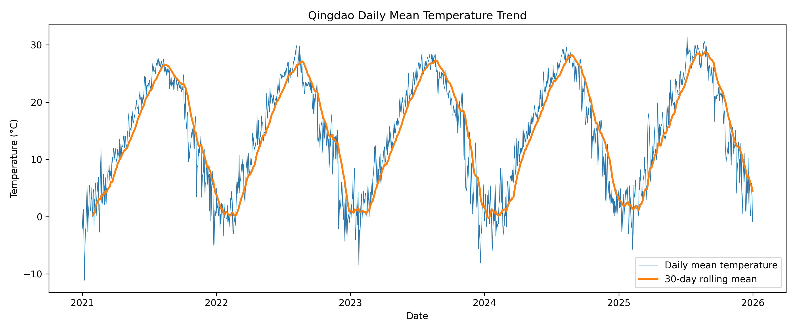
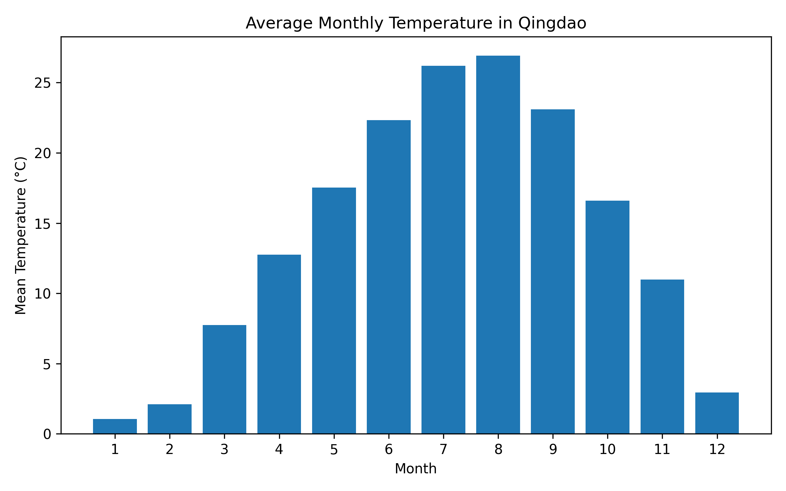
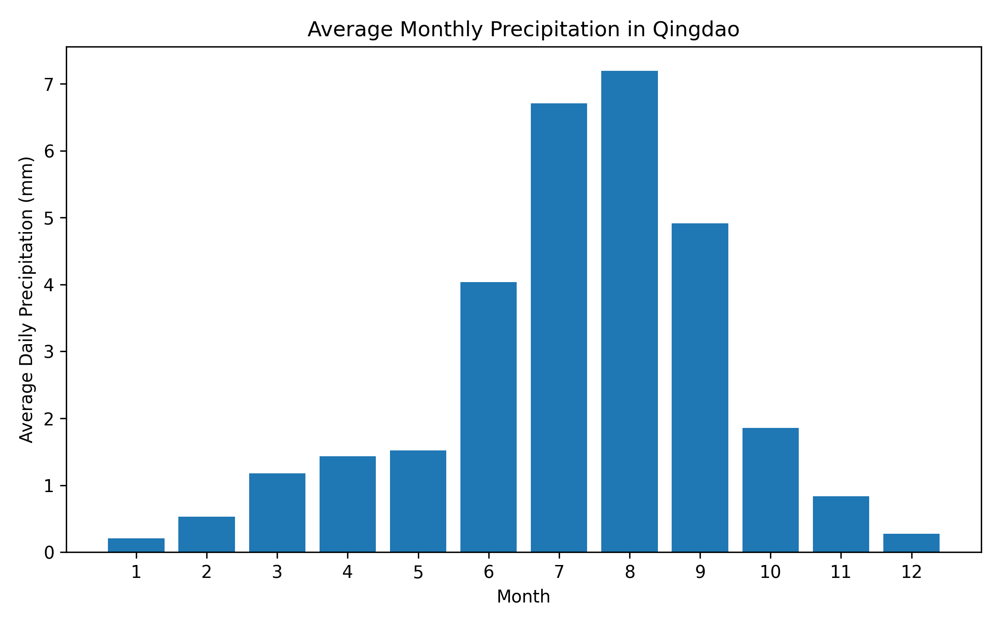
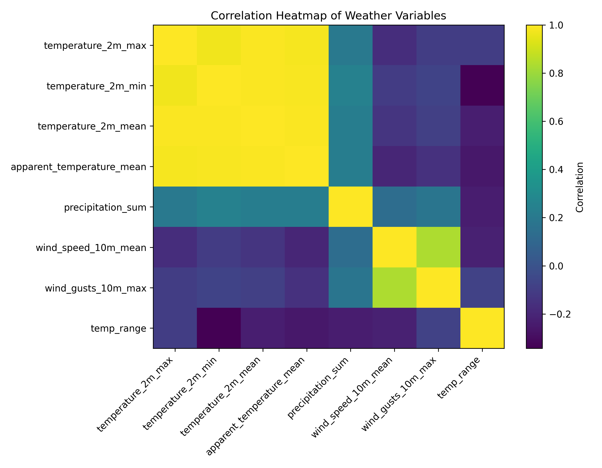
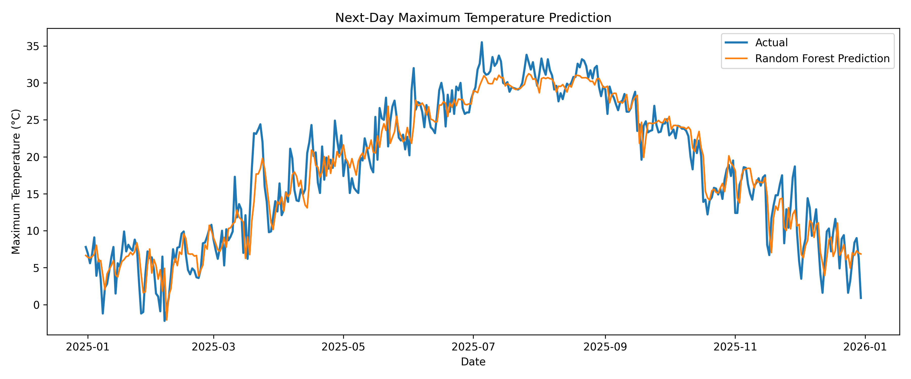

# Qingdao Weather Analysis and Next-Day Temperature Prediction

## Project Overview

This project analyzes historical weather data in Qingdao, China, and builds simple machine learning models to predict the next day's maximum temperature.

The project includes data acquisition, data cleaning, feature engineering, data visualization, and predictive modeling. It is designed as an introductory data analysis and machine learning project that connects mathematical modeling ability with computer science practice.

## Background

I am a Mathematics and Applied Mathematics student interested in computer science, data analysis, and machine learning. Through this project, I hope to practice using Python to solve real-world data problems and prepare for future research training in computer science-related areas.

Qingdao is a coastal city, so weather data analysis is also related to marine, environmental, and urban data analysis. This project serves as a first step toward learning how to process real-world data and build basic prediction models.

## Data Source

The data is obtained from the Open-Meteo Historical Weather API.

Location information:

- City: Qingdao, China
- Latitude: 36.0671
- Longitude: 120.3826
- Time period: 2021-01-01 to 2025-12-31

## Variables Used

The project uses the following daily weather variables:

- Maximum temperature
- Minimum temperature
- Mean temperature
- Apparent temperature
- Precipitation
- Rain
- Maximum wind speed
- Mean wind speed
- Maximum wind gusts

## Project Structure

```text
qingdao-weather-analysis/
├── README.md
├── requirements.txt
├── main.py
├── data/
│   ├── qingdao_weather.csv
│   └── qingdao_weather_cleaned.csv
├── figures/
│   ├── temperature_trend.png
│   ├── monthly_temperature.png
│   ├── monthly_precipitation.png
│   ├── correlation_heatmap.png
│   └── prediction_result.png
└── report/
    └── metrics.txt
```

## Methods

### 1. Data Collection

The weather data is downloaded automatically through an API request. The data includes daily weather records in Qingdao from 2021 to 2025.

### 2. Data Cleaning

The data is sorted by date. Missing values are handled by linear interpolation and median filling. This ensures that the dataset can be used for visualization and model training.

### 3. Feature Engineering

Several new features are constructed:

- Year
- Month
- Day of year
- Daily temperature range
- Rainy day indicator
- 7-day rolling average temperature
- 7-day accumulated precipitation

These features are used to better describe seasonal patterns, short-term temperature changes, and precipitation conditions.

### 4. Data Visualization

The project generates the following visualizations:

- Daily mean temperature trend
- Monthly average temperature
- Monthly precipitation pattern
- Correlation heatmap of weather variables
- Actual vs predicted next-day maximum temperature

The generated figures are saved in the `figures/` folder.

### 5. Prediction Model

The target variable is the next day's maximum temperature.

Two models are compared:

- Linear Regression
- Random Forest Regressor

The model performance is evaluated using:

- Mean Absolute Error
- R2 Score

## Model Results

| Model | MAE | R2 Score |
|---|---:|---:|
| Linear Regression | 1.995 °C | 0.924 |
| Random Forest Regressor | 1.981 °C | 0.926 |

The Random Forest model slightly outperforms Linear Regression. The average prediction error is about 2°C, showing that recent temperature, seasonal features, wind speed, and precipitation-related variables can provide useful information for short-term temperature prediction.

## Result Figures

### Daily Mean Temperature Trend



### Monthly Average Temperature



### Monthly Precipitation Pattern



### Correlation Heatmap



### Next-Day Maximum Temperature Prediction



## How to Run

Install dependencies:

```bash
pip install -r requirements.txt
```

Run the project:

```bash
python main.py
```

After running the program, the generated data, figures, and model report will be saved in the corresponding folders:

```text
data/
figures/
report/
```

## Main Files

- `main.py`: main program for data collection, cleaning, visualization, and model training
- `requirements.txt`: required Python packages
- `data/`: raw and cleaned weather data
- `figures/`: generated visualization results
- `report/metrics.txt`: model evaluation results

## What I Learned

Through this project, I practiced:

- Using Python to obtain data from an API
- Cleaning and organizing structured data with pandas
- Visualizing weather data with matplotlib
- Building simple machine learning models with scikit-learn
- Evaluating prediction models using MAE and R2 Score
- Organizing a complete data analysis project for GitHub

This project helped me understand the basic workflow of a data analysis and machine learning task, including data acquisition, preprocessing, feature construction, model training, evaluation, and project documentation.

## Future Improvements

Possible future improvements include:

- Adding more years of historical weather data
- Comparing more machine learning models
- Using hourly weather data for finer analysis
- Adding marine weather variables
- Building an interactive dashboard
- Applying similar methods to oceanographic datasets

## Author

Chen Jiayi 
Mathematics and Applied Mathematics  
Ocean University of China, Haide College
